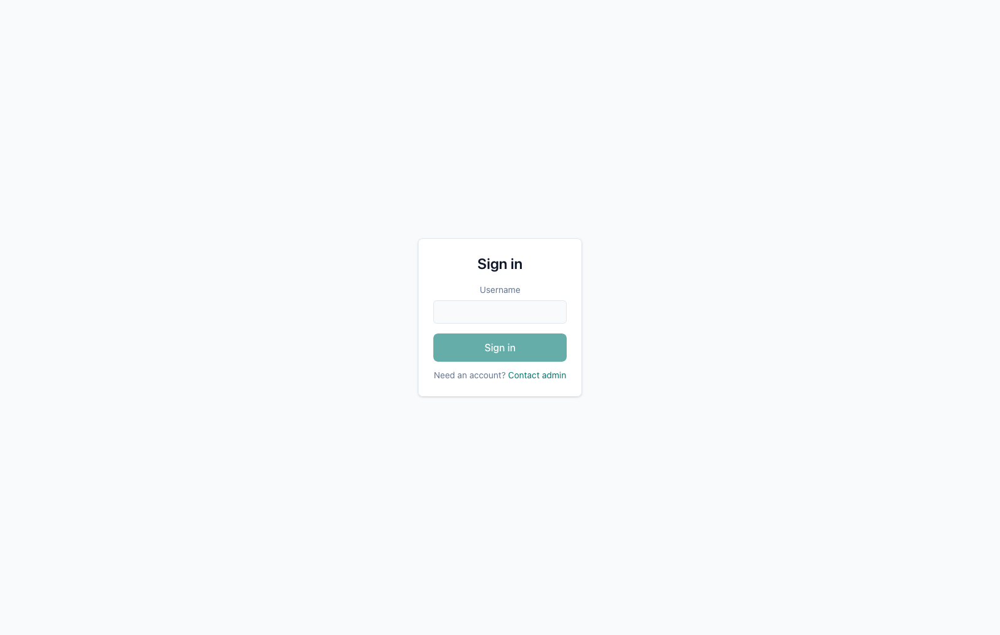
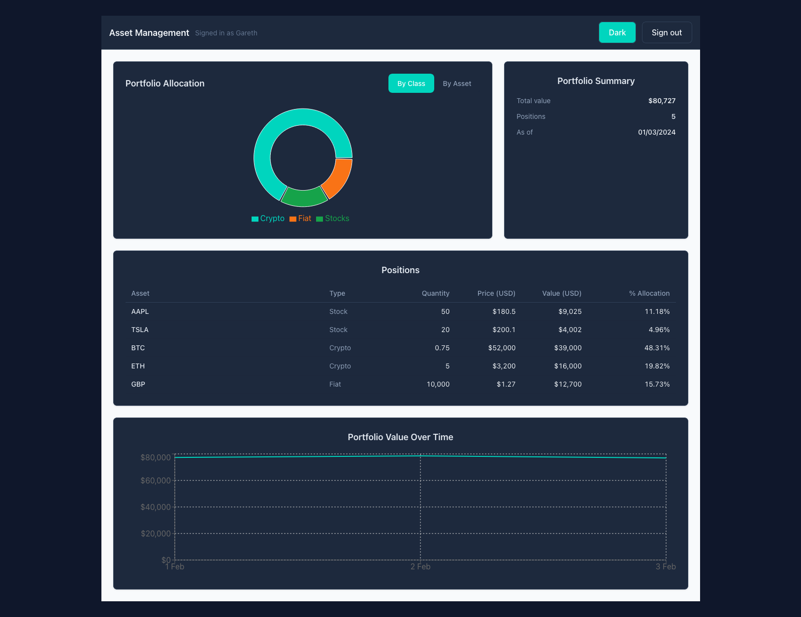
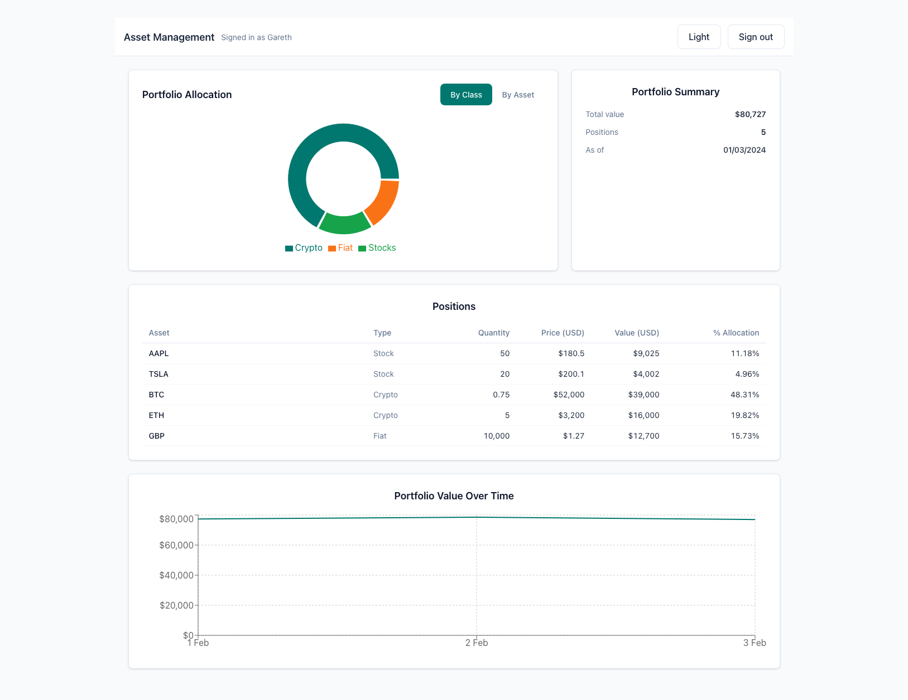

# Asset Management

Small demo app that shows a portfolio dashboard driven by local mock data.

Features

- Uses auth for accessing the Dashboard - simple auth as in you can pass in any username (awareness is this is not secure, but implemented as simple as possible)
- Portfolio Allocation donut chart (by asset / class) — see [src/pages/Dashboard/Dashboard.tsx](src/pages/Dashboard/Dashboard.tsx)
- Portfolio Summary (total value, positions, portfolio as-of) — computed by [`buildPortfolioOverview`](src/utils/portfolioAggregation.ts)
- Positions table (enriched positions with value and allocation)
- Historical portfolio value chart (time-series) computed by [`computePortfolioValueSeries`](src/utils/portfolioAggregation.ts)
- Uses static mock data in `public/mockdata/*` and Cypress fixtures in `cypress/fixtures/*`

### Environment / required versions

This project was developed and tested with the following runtime/tooling versions. Using these (or later compatible versions) is recommended to avoid subtle build/test issues.

- Node.js: 22.x
- Yarn (v1.22.22)

Check your local versions:

```sh
node -v
yarn -v
```

using nvm (recommended) to manage Node versions:

```sh
# install nvm if needed, then:
nvm install 22
nvm use 22
```

### Quickstart (install & run)

1. Install dependencies

```sh
yarn
```

2. Start dev server (Vite)

```sh
yarn dev
```

3. Open http://localhost:5173 in your browser (Vite also prints the actual URL)

### Build & preview

- Build the production bundle:

```sh
yarn build
```

- Preview the built app:

```sh
yarn preview
```

### Mock data

- App requests static JSON under `/mockdata/*`. Edit or inspect:
  - [public/mockdata/assets.json](public/mockdata/assets.json)
  - [public/mockdata/portfolio.json](public/mockdata/portfolio.json)
  - [public/mockdata/prices-current.json](public/mockdata/prices-current.json)
  - [public/mockdata/prices-history.json](public/mockdata/prices-history.json)
- Client API wrappers:
  - [src/api/prices.ts](src/api/prices.ts)

### Testing

Unit & component tests (Vitest + Testing Library)

- Run all unit/component tests:

```sh
yarn test
```

- Configuration: vitest.config.ts. Tests live under `src/**/*.spec.*` (examples:)
  - [src/utils/portfolioAggregation.spec.ts](src/utils/portfolioAggregation.spec.ts)
  - component specs under `src/components/**/*.spec.tsx`

### End-to-end tests (Cypress)

1. Start the dev server in one terminal:

```sh
yarn dev
```

2. In another terminal run Cypress:

- Interactive:

```sh
yarn cypress:open
```

- Headless:

```sh
yarn cypress:run
```

3. Cypress E2E spec:
   - [cypress/e2e/login_and_dashboard.cy.ts](cypress/e2e/login_and_dashboard.cy.ts)
   - Fixtures used by E2E are under `cypress/fixtures/`

### Screenshots

Login screen:



Dark theme dashboard:



Light theme dashboard:



### Notes & troubleshooting

The client uses react-query to fetch the static mock files via [src/api/client.ts](src/api/client.ts).
If a UI control (like a date picker) does not update data, ensure the client code queries a date-aware endpoint or resolves historical prices client-side. See:

- [src/pages/Dashboard/Dashboard.tsx](src/pages/Dashboard/Dashboard.tsx)
- [src/utils/portfolioAggregation.ts](src/utils/portfolioAggregation.ts)
- [src/api/prices.ts](src/api/prices.ts)
  To run tests reliably in CI/local, ensure Node and npm versions are compatible with the project dependencies.

### Useful commands (recap)

- Install: yarn
- Dev server: yarn dev
- Build: yarn build
- Preview: yarn preview
- Unit tests: yarn test
- Cypress (interactive): yarn cypress:open
- Cypress (headless): yarn cypress:run

### License / authorship

Small demo project — see source tree for implementation details.
